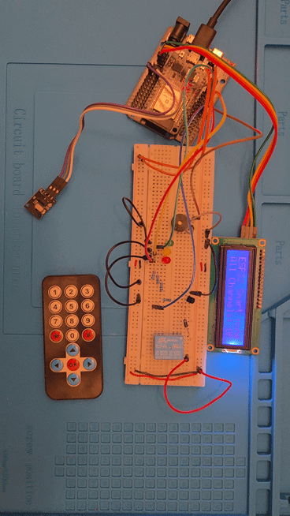
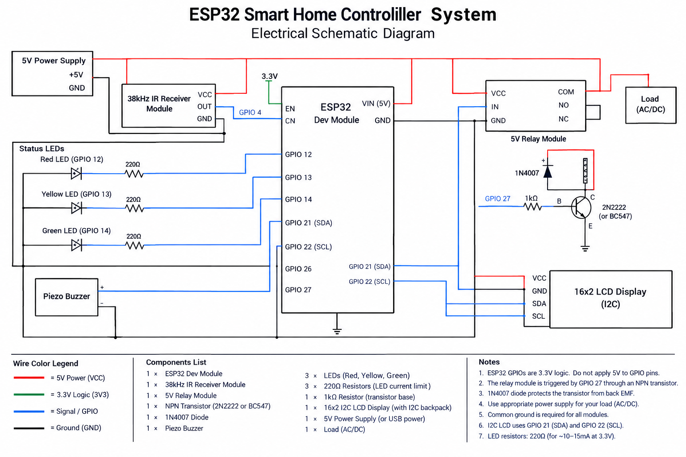
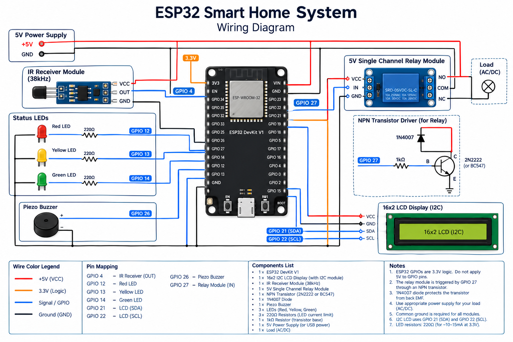
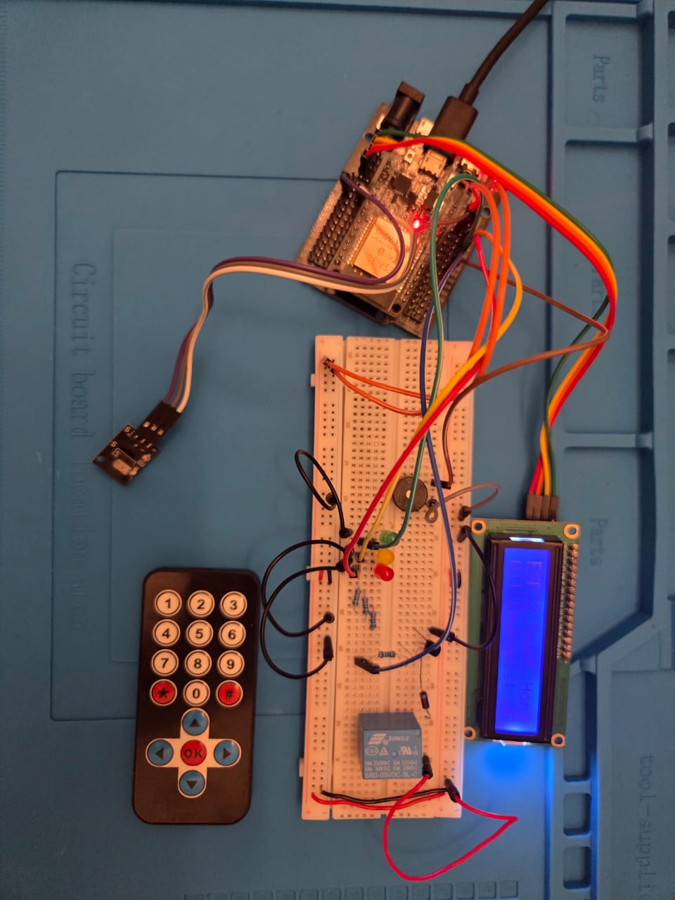

# 🏠 ESP32 Smart Home System with IR Remote & LCD Feedback

An embedded multi-actuator control system powered by the **ESP32 Dev Module**. The system provides real-time wireless control over a 5V Relay Channel and 3 independent status LEDs using a 38kHz IR Remote Control. It features dynamic status feedback on a 16x2 I2C LCD, audible button response via a Piezo Buzzer, optical noise filtering for raw IR data, and complete relay switching safety using an NPN transistor and flyback diode array.

## 🎬 Project Demo



---

## 📌 Features

* **4-Channel Independent Actuator Control**: Wireless switching for 1 Relay Channel (High-Power Loads) and 3 Status LEDs (Red, Yellow, Green) using NEC/RC5 IR protocol signals.
* **Audio-Visual Feedback System**: Real-time display of channel status (`ON` / `OFF`) on a 16x2 I2C LCD with active audible click responses via a Piezo Buzzer.
* **Master Switch Functionality**: Dedicated master control button command to simultaneously toggle or shut down all connected channels.
* **Relay Protection Circuitry**: Transistor-driven switching interface paired with an anti-parallel Flyback Diode (1N4007) to clamp inductive reverse EMF spikes.
* **Noise-Filtered IR Decoding**: Filtering technique checking `decodedRawData != 0` within `IRremote` to reject stray ambient light and noise.

---

## 🛠️ Hardware Requirements

| Component | Quantity | Description / Specification |
| :--- | :---: | :--- |
| **ESP32 DevKit V1** | 1 | 32-bit Microcontroller Board |
| **IR Receiver Module** | 1 | 38kHz Infrared Sensor Receiver (VS1838B) |
| **IR Remote Control** | 1 | Standard Handheld Infrared Transmitter |
| **5V Relay Module** | 1 | 5V DC Single-Channel Relay (SRD-05VDC-SL-C) |
| **16x2 LCD Display** | 1 | HD44780 LCD with PCF8574 I2C Backpack Module |
| **Red LED** | 1 | 5mm Standard Red Status LED |
| **Yellow LED** | 1 | 5mm Standard Yellow Status LED |
| **Green LED** | 1 | 5mm Standard Green Status LED |
| **Piezo Buzzer** | 1 | 5V Active / Passive Audio Feedback Buzzer |
| **NPN Transistor** | 1 | 2N2222 / BC547 Transistor (Relay Driver) |
| **Flyback Diode** | 1 | 1N4007 Rectifier Diode (EMF Clamping) |
| **Resistors** | 4 | 220Ω – 330Ω Current Limiting Resistors |
| **Breadboard & Jumpers** | — | Interconnection Wires & Prototyping Board |

---

## 🔌 Circuit Pinout Connections

### **1. 16x2 I2C LCD Module**
* **VCC** $\rightarrow$ ESP32 **`5V` / `VIN`** *(For display backlight power)*
* **GND** $\rightarrow$ ESP32 **`GND`**
* **SDA** $\rightarrow$ ESP32 **`GPIO 21`** *(Hardware I2C SDA)*
* **SCL** $\rightarrow$ ESP32 **`GPIO 22`** *(Hardware I2C SCL)*

### **2. 38kHz IR Receiver Module**
* **VCC** $\rightarrow$ ESP32 **`3.3V` / `5V`**
* **GND** $\rightarrow$ ESP32 **`GND`**
* **OUT / DATA** $\rightarrow$ ESP32 **`GPIO 4`**

### **3. Relay Driver Subsystem (Channel 1)**
* **Control Output** $\rightarrow$ ESP32 **`GPIO 27`** $\rightarrow$ **220Ω Resistor** $\rightarrow$ **Transistor Base (B)**
* **Transistor Emitter (E)** $\rightarrow$ Common **`GND`**
* **Transistor Collector (C)** $\rightarrow$ Relay Coil (-) & Diode Anode
* **Relay Coil (+)** $\rightarrow$ ESP32 **`5V`** & Diode Cathode

### **4. Status LEDs & Audio Subsystem (Channels 2–4 & Buzzer)**
* **Red LED (Ch 2)** $\rightarrow$ ESP32 **`GPIO 12`** $\rightarrow$ **220Ω Resistor** $\rightarrow$ LED (+) $\rightarrow$ **GND**
* **Yellow LED (Ch 3)** $\rightarrow$ ESP32 **`GPIO 13`** $\rightarrow$ **220Ω Resistor** $\rightarrow$ LED (+) $\rightarrow$ **GND**
* **Green LED (Ch 4)** $\rightarrow$ ESP32 **`GPIO 14`** $\rightarrow$ **220Ω Resistor** $\rightarrow$ LED (+) $\rightarrow$ **GND**
* **Piezo Buzzer** $\rightarrow$ ESP32 **`GPIO 26`** $\rightarrow$ Buzzer (+) $\rightarrow$ **GND**

---

## 📐 Circuit Diagrams & Setup

| 2D Schematic Diagram | 2D Circuit View | Real Hardware Setup |
| :---: | :---: | :---: |
|  |  |  |

* 📄 Download Bill of Materials: [components.csv](schematics/components.csv)

---

## 📂 Project Structure

```text
ESP32 Smart Home System IR Control/
├── .gitignore
├── README.md
├── src/
│   └── main.ino
└── schematics/
    ├── circuit_diagram.png
    ├── circuit_image.png
    ├── circuit_real.jpeg
    ├── components.csv
    └── demo.gif

```

---

## 🚀 How to Run & Setup

1. **Hardware Assembly**: Connect all components following the pinout instructions listed in the **Circuit Pinout Connections** section. Ensure a Common Ground (GND) is shared across all modules.
2. **Setup Arduino IDE**:
* Open Arduino IDE and install the ESP32 Board Package (**Tools > Board > Boards Manager**).
* Install required libraries via **Library Manager**:
* `IRremote` (by Armin Joachimsmeyer)
* `LiquidCrystal_I2C` (by Frank de Brabander)


3. **Upload Code**:
* Open `src/main.ino` in Arduino IDE.
* Select your ESP32 board (**Tools > Board > ESP32 Dev Module**) and target COM Port.
* Set **Upload Speed** to `115200` to prevent communication timeouts.
* Upload the sketch.


---

## 💻 Source Code (`src/main.ino`)

C++
```
#include <Arduino.h>
#include <Wire.h>
#include <LiquidCrystal_I2C.h>
#include <IRremote.hpp>

// ==================== Pin Mappings ====================
#define IR_RECEIVE_PIN    4   // IR Receiver Pin
#define RELAY_PIN        27   // Channel 1: Relay
#define RED_LED_PIN      12   // Channel 2: RED LED
#define YELLOW_LED_PIN   13   // Channel 3: YELLOW LED 
#define GREEN_LED_PIN    14   // Channel 4: GREEN LED
#define BUZZER_PIN       26   // Piezo Buzzer Pin

// I2C LCD Display Instance (Address: 0x27, 16 Cols, 2 Rows)
LiquidCrystal_I2C lcd(0x27, 16, 2);

// ==================== IR Command Codes (Hex) ====================
#define HEX_BTN_1   0x12  // Channel 1 Code (Relay)
#define HEX_BTN_2   0x16  // Channel 2 Code (Red LED)
#define HEX_BTN_3   0x17  // Channel 3 Code (Yellow LED)
#define HEX_BTN_4   0x18  // Channel 4 Code (Green LED)
#define HEX_BTN_5   0x52  // Channel 5 Code (Master Switch)

// State Tracking Variables
bool relayState  = false;
bool redState    = false;
bool yellowState = false;
bool greenState  = false;

// Function for Audible Beep Feedback
void triggerBeep() {
  digitalWrite(BUZZER_PIN, HIGH);
  delay(80);
  digitalWrite(BUZZER_PIN, LOW);
}

// Function to Update Display Content
void updateLCD(String title, String status) {
  lcd.clear();
  lcd.setCursor(0, 0);
  lcd.print("ESP32 Smart Home");
  lcd.setCursor(0, 1);
  lcd.print(title + ": " + status);
}

void setup() {
  Serial.begin(115200);

  // Configure Output Pins
  pinMode(RELAY_PIN, OUTPUT);
  pinMode(RED_LED_PIN, OUTPUT);
  pinMode(YELLOW_LED_PIN, OUTPUT);
  pinMode(GREEN_LED_PIN, OUTPUT);
  pinMode(BUZZER_PIN, OUTPUT);

  // Initial State: All Outputs OFF
  digitalWrite(RELAY_PIN, LOW);
  digitalWrite(RED_LED_PIN, LOW);
  digitalWrite(YELLOW_LED_PIN, LOW);
  digitalWrite(GREEN_LED_PIN, LOW);
  digitalWrite(BUZZER_PIN, LOW);

  // Initialize I2C Bus and LCD Display
  Wire.begin(21, 22);
  lcd.init();
  lcd.backlight();

  // Welcome Screen Message
  lcd.setCursor(0, 0);
  lcd.print("  ESP32 System  ");
  lcd.setCursor(0, 1);
  lcd.print(" Ready for IR.. ");
  delay(2000);
  lcd.clear();
  lcd.print("System Active");

  // Start IR Receiver Service
  IrReceiver.begin(IR_RECEIVE_PIN, DISABLE_LED_FEEDBACK);
  Serial.println("ESP32 System Ready. Waiting for IR Signals...");
}

void loop() {
  if (IrReceiver.decode()) {

    // Noise Filter: Check for Valid Raw Data
    if (IrReceiver.decodedIRData.decodedRawData != 0) {
      uint32_t receivedCode = IrReceiver.decodedIRData.command;

      Serial.print("Received Hex Command: 0x");
      Serial.println(receivedCode, HEX);

      // --- Channel 1: Relay Control ---
      if (receivedCode == HEX_BTN_1) {
        relayState = !relayState;
        digitalWrite(RELAY_PIN, relayState ? HIGH : LOW);
        triggerBeep();
        updateLCD("Relay Ch1", relayState ? "ON " : "OFF");
      }
      // --- Channel 2: Red LED Control --- 
      else if (receivedCode == HEX_BTN_2) {
        redState = !redState;
        digitalWrite(RED_LED_PIN, redState ? HIGH : LOW);
        triggerBeep();
        updateLCD("Red LED Ch2", redState ? "ON " : "OFF");
      }
      // --- Channel 3: Yellow LED Control ---
      else if (receivedCode == HEX_BTN_3) {
        yellowState = !yellowState;
        digitalWrite(YELLOW_LED_PIN, yellowState ? HIGH : LOW);
        triggerBeep();
        updateLCD("Yellow LED Ch3", yellowState ? "ON " : "OFF");
      }
      // --- Channel 4: Green LED Control ---
      else if (receivedCode == HEX_BTN_4) {
        greenState = !greenState;
        digitalWrite(GREEN_LED_PIN, greenState ? HIGH : LOW);
        triggerBeep();
        updateLCD("Green LED Ch4", greenState ? "ON " : "OFF");
      }
      // --- Master Control: Toggle All Channels ---
      else if (receivedCode == HEX_BTN_5) {
        bool newState = !relayState;
        relayState = redState = yellowState = greenState = newState;

        digitalWrite(RELAY_PIN, relayState ? HIGH : LOW);
        digitalWrite(RED_LED_PIN, redState ? HIGH : LOW);
        digitalWrite(YELLOW_LED_PIN, yellowState ? HIGH : LOW);
        digitalWrite(GREEN_LED_PIN, greenState ? HIGH : LOW);

        triggerBeep();
        updateLCD("All Channels", newState ? "ON " : "OFF");
      }
    }
    
    // Prepare IR Receiver for Next Pulse
    IrReceiver.resume();
  }
}

```
